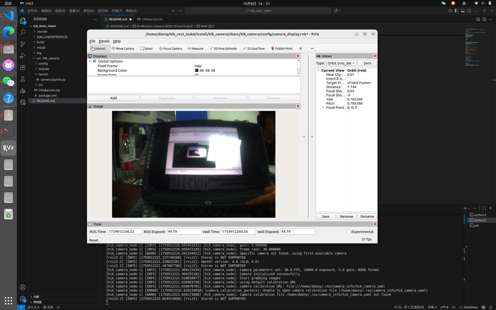
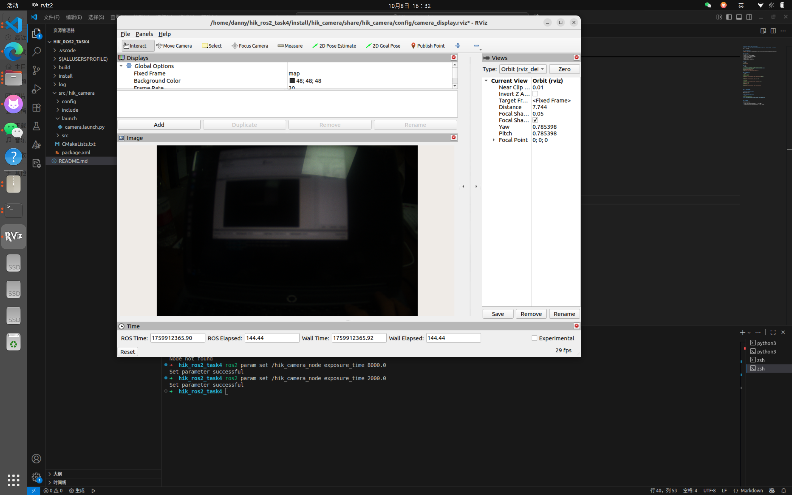

# Hikvision Camera ROS2 Driver(Task4)海康威视相机ROS2驱动程序（Task4）
**该项目为一个用于海康威视工业相机的ROS2功能包，支持实时参数调整和稳定的图像流发布**

已进行线下验收

### 海康威视SDK下载

[SDK下载链接](https://www.hikrobotics.com/cn/machinevision/service/download/?module=0)

### 参数配置
| 参数名 | 说明 |
| -- | -- |
| camera_ip | GigE相机IP地址|
| camera_serial | USB相机序列号 |
| frame_rate | 帧率 |
| exposure_time | 曝光时间 |
| gain | 增益 |
| pixel_format | 像素格式 |


### 编译
```shell   “‘壳
colcon build    colcon构建   colcon构建
```

### 运行
```shell   “‘壳
# 环境变量有一些问题（暂未找到原因）临时解决方案
export LD_LIBRARY_PATH=/opt/MVS/lib/64:$LD_LIBRARY_PATH出口LD_LIBRARY_PATH = / opt / MVS / lib / 64: LD_LIBRARY_PATH美元出口LD_LIBRARY_PATH = / opt / MVS / lib / 64: LD_LIBRARY_PATH美元
# 同时启动相机节点与RViz节点
source install/setup.zsh
ros2 launch hik_camera camera.launch.pyRos2启动hik_camera camera.launch.py
```

### 动态调整参数
```shell   “‘壳
# 新建一个终端

# 调整曝光时间
ros2 param set /hik_camera_node exposure_time 8000.0

# 调整增益
ros2 param set /hik_camera_node gain 5.0

# 调整帧率
ros2 param set /hik_camera_node frame_rate 25.0

# 查看所有参数
ros2 param list

#查看曝光时间
ros2 param get /hik_camera_node exposure_time 

```


### 开发遇到的问题

**SDK安装包路径没有include**

重新安装下载解决

**运行launch文件出现error**

```shell
#终端中输入（临时解决）
export LD_LIBRARY_PATH=/opt/MVS/lib/64 :$LD_LIBRARY_PATHexport LD_LIBRARY_PATH=/opt/MVS/lib/64:$LD_LIBRARY_PATH . export LD_LIBRARY_PATH=/opt/MVS/lib/64:$LD_LIBRARY_PATH
```


### 话题列表

节点发布以下话题：

- /image_raw (sensor_msgs/Image) - 原始图像数据
- /camera_info (sensor_msgs/CameraInfo) - 相机标定信息

### vscode配置

```shell
{
    "cmake.sourceDirectory": "/home/danny/hik_ros2_task4/src/hik_camera"
}
```

### 测试结果

#### 修改曝光时间前



#### 修改曝光时间后

```shell   “‘壳
ros2 param set /hik_camera_node exposure_time 8000.0Ros2 param set /hik_camera_node exposure_time 8000.0
```


